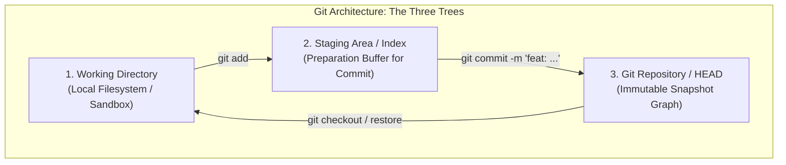
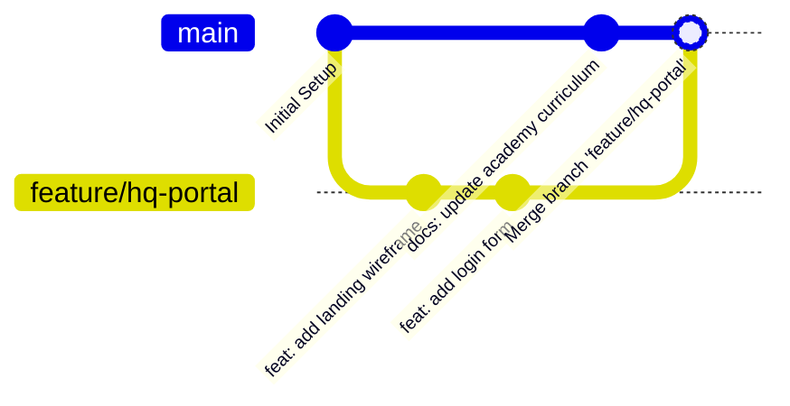

# 🚀 Git & GitHub Foundations — High Q Solid Academy

<div align="center">

# High Q Solid Academy
### *Web Development Track 01 &bull; Git & GitHub Version Control*
**"Always Ahead of Others"**

[](https://github.com/High-Q-Solid-Academy/course-git-github)
[](https://highqsolidacademy.com)
[](https://highqsolidacademy.com)

</div>

---

## 📖 Theoretical Foundations: Version Control Architecture

*Reference: GitHub Essentials by Achilleas Pipinellis (Packt Publishing)*

### 1. The Snapshot Model vs Delta Storage
Traditional Version Control Systems (like CVS or Subversion) store information as a list of file-based changes (deltas). Git thinks about its data much more like a **stream of snapshots**. Every time you commit, Git essentially takes a picture of what all your files look like at that moment and stores a reference to that snapshot. To be efficient, if files have not changed, Git doesn't store the file again, just a link to the previous identical file it has already stored.



### 2. Cryptographic Integrity: The SHA-1 Object Store
In Git, everything is checksummed before it is stored and is then referred to by that checksum. This mechanism uses a 40-character hexadecimal string called a **SHA-1 hash** (e.g., `351b33bd7380a2434aaaea91eb8cb0ddc3b56852`).
- It is impossible to change the contents of any file or directory without Git knowing about it.
- Git stores four fundamental object types in the `.git/objects` directory:
  1. **Blob**: Raw binary file content (independent of filename or permissions).
  2. **Tree**: Represents a directory, linking filenames to their respective blob hashes or subtrees.
  3. **Commit**: Points to a root tree object, records author/committer metadata, timestamp, commit message, and parent commit hashes.
  4. **Annotated Tag**: A permanent pointer to a specific commit containing a tagger message and signature.

```mermaid
graph LR
    subgraph Git Object Graph (DAG)
        CommitA["Commit A<br/>(Root Commit)"] --> TreeA["Tree<br/>(Directory)"]
        TreeA --> Blob1["Blob: index.html"]
        TreeA --> Blob2["Blob: style.css"]
        
        CommitB["Commit B<br/>(Parent: Commit A)"] --> TreeB["Tree"]
        CommitB -.-> CommitA
        TreeB --> Blob1
        TreeB --> Blob3["Blob: style.css (Updated)"]
    end
```

### 3. Branching Mechanics & The DAG (Directed Acyclic Graph)
A branch in Git is simply a lightweight, movable pointer to one of these commits. The default branch name is `main`. Every time you commit, the branch pointer moves forward automatically.

- **Fast-Forward Merge**: When the target branch has no divergent commits from the source branch, Git simply moves the pointer forward.
- **Three-Way Merge**: When histories diverge, Git locates the **common ancestor** commit and combines the differences, creating a dedicated **Merge Commit** with two parent hashes.



---

## 🚀 High Q 25-Step Spiral: Milestone 1
At High Q Solid Academy, version control is not taught in isolation. It forms **Step 1** of your development workflow:
1. Every line of code for the **High Q Solid Student Portal** must be tracked in Git.
2. Every feature (from HTML tags to React components) lives on an isolated feature branch.
3. Every merge requires an inspected Pull Request with Conventional Commits.

---

## 📋 Course Curriculum & Labs

### Module 1: The Basics of Git
- Identity configuration:
  ```bash
  git config --global user.name "Your Name"
  git config --global user.email "your.email@example.com"
  ```
- Repository initialization: `git init`
- The Three Stages of Git:
  1. **Working Directory** (Unstaged)
  2. **Staging Area** (`git add <file>` or `git add .`)
  3. **Repository** (`git commit -m "feat: description"`)

### Module 2: Inspection & History
- Checking status: `git status`
- Reading commit logs: `git log --oneline --graph --decorate`
- Comparing changes: `git diff`

### Module 3: Branching & Merging
- Creating branches: `git branch feature/my-cool-feature`
- Switching branches: `git checkout feature/my-cool-feature` or `git switch feature/my-cool-feature`
- Creating & switching in one command: `git checkout -b feature/my-cool-feature`
- Merging back to main:
  ```bash
  git checkout main
  git merge feature/my-cool-feature
  ```
- Resolving Merge Conflicts step-by-step.

### Module 4: Working with GitHub & Pull Requests
- Linking a remote: `git remote add origin <url>`
- Pushing code: `git push -u origin feature/my-cool-feature`
- Opening a **Pull Request (PR)** on GitHub
- Code review workflows, milestones, and labels.

---

## 🧪 Interactive Hands-On Labs

Complete the following labs located in the `exercises/` folder:

1. **[Lab 1: Your First Clean Commits](exercises/lab-1-commits/README.md)**
   - Stage your student profile and construct conventional commit messages according to snapshot theory.
2. **[Lab 2: Branching & Safe Merging](exercises/lab-2-branching/README.md)**
   - Create a feature branch, create an isolated component, and merge cleanly into `main`.
3. **[Lab 3: Opening an Inspected Pull Request](exercises/lab-3-pull-request/README.md)**
   - Push your branch to GitHub and open a Pull Request using our High Q PR template.

---

## 🤖 Automated Verification Workflow

This repository is equipped with an automated GitHub Action (`.github/workflows/verify-git.yml`):
- Whenever you open or update a Pull Request, the workflow will automatically check:
  - ✅ Your commit messages conform to **Conventional Commits** (e.g. `feat: add student bio`, `docs: update notes`).
  - ✅ Your Pull Request template has been properly filled out.
  - ✅ No unstaged or temporary files were committed.

---

<div align="center">
  <sub>High Q Solid Academy &bull; <a href="https://highqsolidacademy.com">highqsolidacademy.com</a></sub>
</div>
