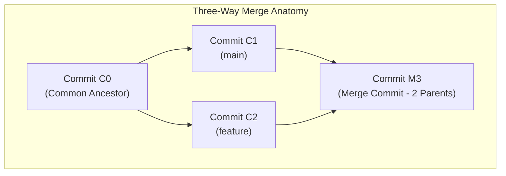

# Lab 2: Branching & Safe Merging

<div align="center">

### High Q Solid Academy &bull; Version Control Lab 02
**"Always Ahead of Others"**

</div>

---

## 📖 Theoretical Foundations: Branching & Merge Algorithms

*Reference: GitHub Essentials, Chapter 1 & Chapter 2*

### 1. What is a Git Branch?
In many version control systems, branching requires copying all project files into a separate directory, which is expensive and slow. In Git, **a branch is simply a 41-byte text file containing a 40-character SHA-1 hash** pointing to the tip of a commit lineage.
- Creating a branch (`git branch <name>`) takes less than a millisecond.
- The special pointer `HEAD` represents your current active branch or commit.
- When you switch branches (`git switch <name>` or `git checkout <name>`), Git updates `HEAD` and changes the files in your working directory to match the commit that the new branch points to.

### 2. Fast-Forward vs Three-Way Merges
When integrating branches, Git selects one of two primary algorithms:

1. **Fast-Forward (`--ff`)**: If the current branch has not progressed since the feature branch diverged, Git simply slides the branch pointer forward to the feature branch's latest commit. No new commit object is created.
2. **Three-Way Merge (`--no-ff` or divergent branches)**: If both `main` and your feature branch have new commits, Git identifies the **Common Ancestor** commit, calculates two sets of diffs, merges them into a new **Merge Commit**, and sets its parent references to both branches.



### 3. Merge Conflict Anatomy
When two branches modify the exact same lines of a file, Git halts the merge and injects conflict markers directly into the file:
```text
<<<<<<< HEAD (Current Branch)
Welcome to High Q Portal — Main Campus
=======
Welcome to High Q Portal — Ikorodu Headquarters
>>>>>>> feature/hq-card (Incoming Branch)
```
**Resolution Workflow**:
1. Open the conflicted file.
2. Discuss with your team and decide which lines to keep.
3. Remove the conflict markers (`<<<<<<<`, `=======`, `>>>>>>>`).
4. Stage the resolved file with `git add <file>`.
5. Run `git commit` to finalize the merge.

---

## 📋 Hands-On Lab Instructions

1. **Confirm a clean `main` branch**:
   ```bash
   git checkout main
   git status
   ```
2. **Create and checkout a new feature branch**:
   ```bash
   git checkout -b feature/hq-card
   ```
3. **Add your new component file**:
   Inside this folder (`exercises/lab-2-branching/`), create `my-card.txt` containing:
   ```text
   High Q Solid Academy - Student Card Component
   Status: Active Student
   Track: Web Development Spiral Architecture
   ```
4. **Stage and commit the feature**:
   ```bash
   git add exercises/lab-2-branching/my-card.txt
   git commit -m "feat: add student card component notes"
   ```
5. **Switch back to `main`**:
   ```bash
   git checkout main
   ```
   Notice that `my-card.txt` is temporarily absent from your working tree because `main` does not point to that commit yet!
6. **Execute the merge**:
   ```bash
   git merge feature/hq-card
   ```
7. **Inspect the resulting graph**:
   ```bash
   git log --oneline --graph --decorate -3
   ```

---

<div align="center">
  <sub>High Q Solid Academy &bull; <a href="https://highqsolidacademy.com">highqsolidacademy.com</a></sub>
</div>
