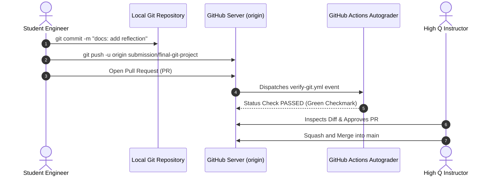

# Lab 3: Opening an Inspected Pull Request

<div align="center">

### High Q Solid Academy &bull; Version Control Lab 03
**"Always Ahead of Others"**

</div>

---

## 📖 Theoretical Foundations: Remotes, Pull Requests & Code Review

*Reference: GitHub Essentials, Chapter 1 & Chapter 3*

### 1. The Distributed Remote Architecture
In Git, a remote is a reference to a version of your repository hosted on the network or internet (such as GitHub).
- `origin`: The default alias given to the primary remote server.
- Remote tracking branches (e.g. `origin/main`): Local read-only pointers that reflect the state of the remote repository at the time you last communicated (`git fetch` or `git push`).
- Pushing (`git push -u origin <branch>`): Uploads local commit snapshots and sets up upstream tracking, allowing subsequent operations to simply use `git push` or `git pull`.



### 2. The Pull Request as a Collaboration Contract
A **Pull Request (PR)** is not a Git command; it is a GitHub feature that proposes changes from one branch into another.
1. **The Diff View**: Compares additions (green) and deletions (red) across files.
2. **Inline Comments**: Reviewers can leave comments on specific lines of code.
3. **Automated Status Checks**: CI workflows validate code style, syntax, and unit tests before any merge occurs.
4. **Issue Linking**: Using keywords like `Closes #12` or `Fixes #45` in your PR description automatically closes associated GitHub Issues upon merge.

---

## 📋 Hands-On Lab Instructions

1. **Create and switch to your submission branch**:
   ```bash
   git checkout -b submission/final-git-project
   ```
2. **Create `student-reflection.md`**:
   In `exercises/lab-3-pull-request/student-reflection.md`, answer these 3 engineering questions:
   - What is the difference between Git's Working Tree, Staging Area, and Repository?
   - Why do we enforce Conventional Commits at High Q Solid Academy?
   - How does a Pull Request protect code quality before merging to `main`?
3. **Stage and commit your reflection**:
   ```bash
   git add exercises/lab-3-pull-request/student-reflection.md
   git commit -m "docs: add git engineering reflection for Lab 3"
   ```
4. **Push your branch to GitHub**:
   ```bash
   git push -u origin submission/final-git-project
   ```
5. **Open your Pull Request**:
   - Go to your repository on GitHub (`https://github.com/High-Q-Solid-Academy/course-git-github`).
   - Click **Compare & Pull Request**.
   - Fill in the High Q Pull Request template.
   - Confirm that the GitHub Actions automated verification runs and passes!

---

<div align="center">
  <sub>High Q Solid Academy &bull; <a href="https://highqsolidacademy.com">highqsolidacademy.com</a></sub>
</div>
